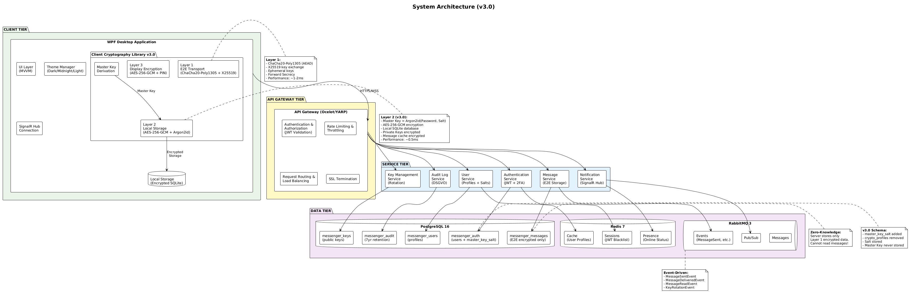
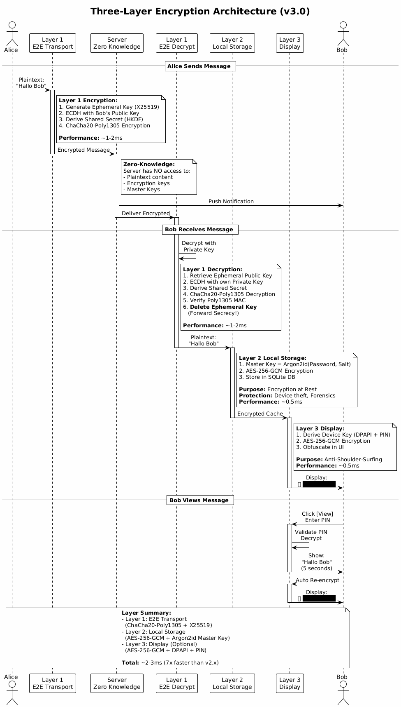
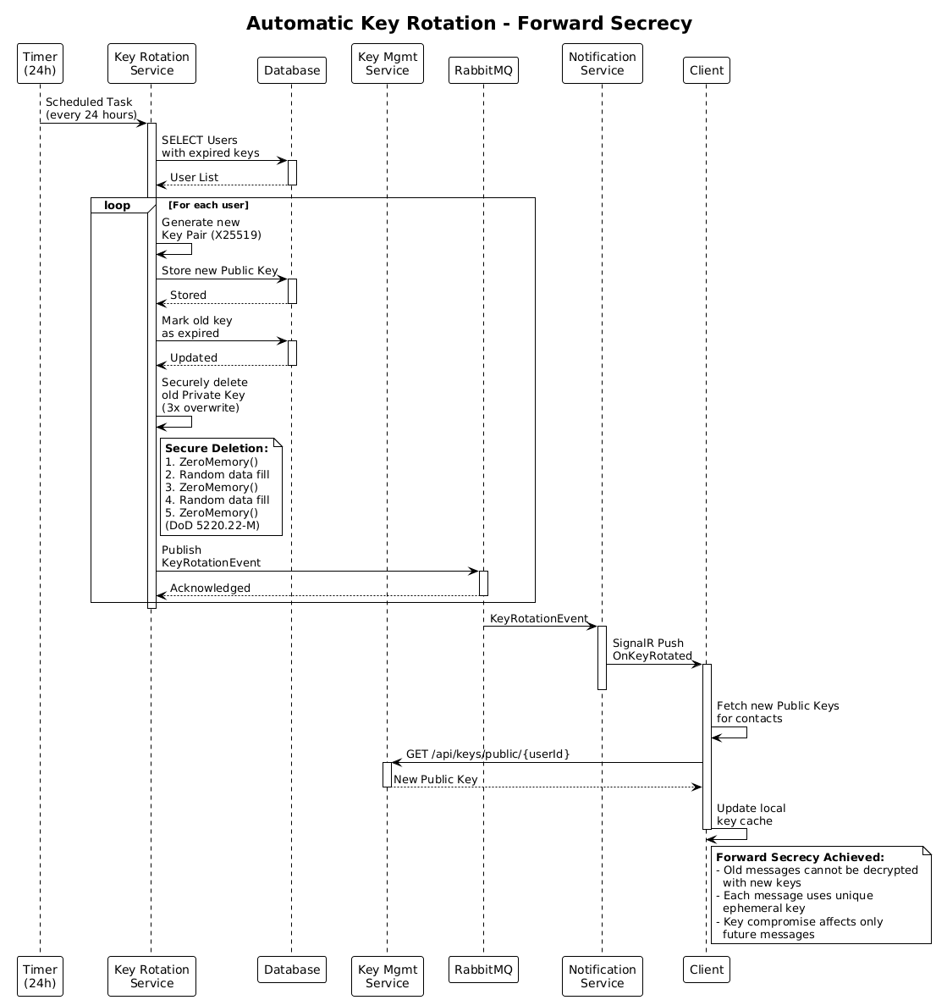
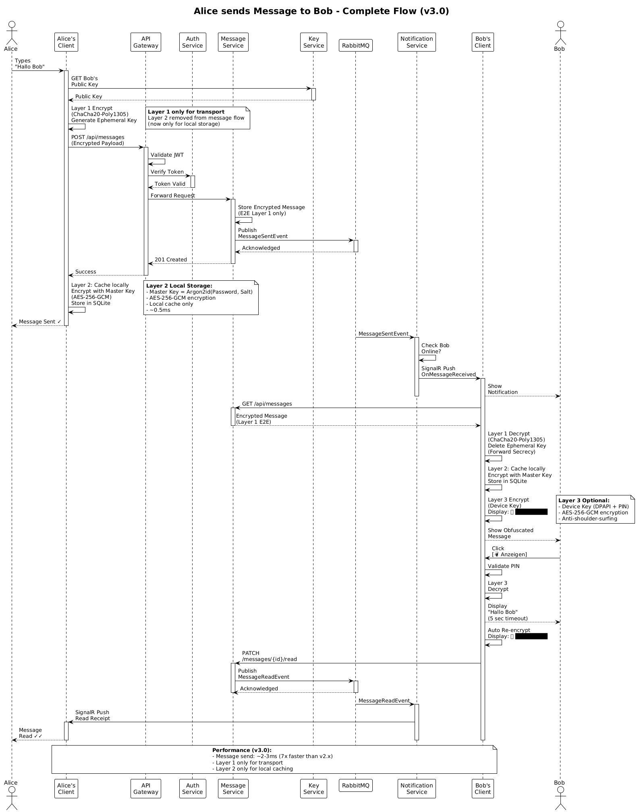
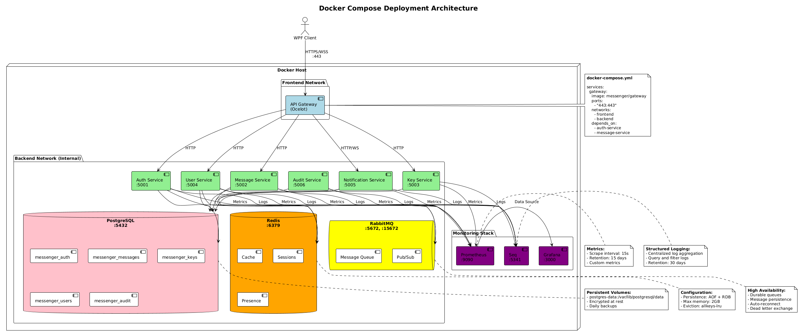
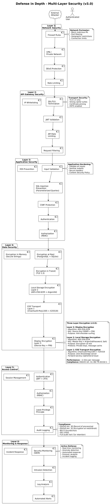

# System-Architektur

## 1. Übersicht

Die Secure Messenger Application basiert auf einer **Microservice-Architektur** mit Event-Driven Communication und vollständiger Docker-Containerisierung.

> **📋 Detaillierte Begründungen**: Siehe [Projektantrag - Technologische Entscheidungen](01_PROJECT_PROPOSAL.md#5-technologische-entscheidungen--begründungen)

### Architektur-Prinzipien

1. **Separation of Concerns**: Jeder Service hat eine klar definierte Verantwortlichkeit
2. **Loose Coupling**: Services kommunizieren über definierte APIs
3. **High Cohesion**: Zusammengehörige Funktionalität ist in einem Service
4. **Stateless Services**: Keine Session-Affinität erforderlich
5. **Event-Driven**: Asynchrone Kommunikation über Message Queue
6. **API-First**: Alle Services bieten REST/HTTP APIs

## 2. High-Level Architektur


> **Diagramm-Quelle**: [01_system_architecture.puml](diagrams/01_system_architecture.puml)

## 3. Service-Übersicht

| Service | Verantwortung | Technologie | Port |
|---------|---------------|-------------|------|
| **Authentication Service** | User Management, Login, 2FA | ASP.NET Core 8, PostgreSQL, Redis | 5001 |
| **Message Service** | Encrypted Messaging, History | ASP.NET Core 8, PostgreSQL, RabbitMQ | 5002 |
| **Key Management Service** | Key Storage, Rotation | ASP.NET Core 8, PostgreSQL | 5003 |
| **User Service** | Profiles, Contacts, Master Key Salts | ASP.NET Core 8, PostgreSQL, Redis | 5004 |
| **Notification Service** | Real-time Push, Status | SignalR, Redis, RabbitMQ | 5005 |
| **Audit Log Service** | DSGVO Logging, Compliance | ASP.NET Core 8, PostgreSQL | 5006 |
| **API Gateway** | Routing, Auth, Rate Limiting | Ocelot/YARP | 5000 |

### 3.1 API-Endpoints

> **📋 Detaillierte Datenmodelle**: Siehe [Datenmodell](05_DATA_MODEL.md)

#### Authentication Service

```
POST   /api/auth/register          # Registrierung
POST   /api/auth/login             # Login mit JWT
POST   /api/auth/logout            # Logout
POST   /api/auth/refresh-token     # Token erneuern
POST   /api/auth/2fa/enable        # 2FA aktivieren
POST   /api/auth/2fa/verify        # 2FA verifizieren
POST   /api/auth/password-reset    # Passwort zurücksetzen
```

#### Message Service

```
POST   /api/messages                      # Nachricht senden
GET    /api/messages/{contactId}          # Nachrichten abrufen
DELETE /api/messages/{messageId}          # Nachricht löschen
PATCH  /api/messages/{messageId}/read     # Als gelesen markieren
GET    /api/messages/search?q={query}     # Suche (verschlüsselt)
```

#### Key Management Service

```
POST   /api/keys/public              # Public Key registrieren
GET    /api/keys/public/{userId}     # Public Key abrufen
POST   /api/keys/rotate              # Manuelle Rotation
DELETE /api/keys/{keyId}             # Key widerrufen
GET    /api/keys/history             # Key History
```

#### User Service

```
GET    /api/users/{userId}                    # Profil abrufen
PUT    /api/users/{userId}                    # Profil aktualisieren
GET    /api/users/search?q={query}            # Benutzer suchen
POST   /api/users/contacts                    # Kontakt hinzufügen
DELETE /api/users/contacts/{id}               # Kontakt entfernen
GET    /api/users/{userId}/salt               # Master Key Salt abrufen (für lokale Key-Derivation)
```

## 4. Verschlüsselungsarchitektur

> **📋 Vollständige Kryptographie-Details**: Siehe [Kryptographie-Konzept](03_CRYPTOGRAPHY.md)


> **Diagramm-Quelle**: [02_encryption_layers.puml](diagrams/02_encryption_layers.puml)

### 4.1 Drei-Ebenen-Verschlüsselung

**Layer 3 (Display - Optional)** → Anti-Shoulder-Surfing (AES-256-GCM, Device Key, PIN)  
**Layer 2 (Local Storage)** → Password-based Encryption at Rest (AES-256-GCM, Argon2id Master Key)  
**Layer 1 (E2E Transport)** → ChaCha20-Poly1305 + Forward Secrecy (X25519, Ephemeral Keys)

**Zweck der drei Ebenen**:
- **Layer 1**: Schutz während der Übertragung (Zero-Knowledge Server)
- **Layer 2**: Schutz lokaler Daten bei Gerätediebstahl/Forensik (Encryption at Rest)
- **Layer 3**: Lokale Privatsphäre (Schutz vor physischem Mitlesen)

### 4.2 Schlüsselrotation


> **Diagramm-Quelle**: [04_key_rotation_sequence.puml](diagrams/04_key_rotation_sequence.puml)

**Prinzip**: Automatische Rotation nach jeder Nachricht garantiert Forward Secrecy.

## 5. Kommunikationsmuster

### 5.1 Synchrone Kommunikation (HTTP/REST)

```
Client → API Gateway → Service (Sync Response)
```

**Verwendung**: User-initiierte Aktionen, Datenabfragen, CRUD

### 5.2 Asynchrone Kommunikation (RabbitMQ)

```
Service A → RabbitMQ → Service B, Service C (Async Events)
```

**Verwendung**: Nachrichtenzustellung, Event-Benachrichtigungen, Long-running Tasks

**Events**:
- `MessageSentEvent`
- `MessageDeliveredEvent`
- `MessageReadEvent`
- `KeyRotationEvent`
- `UserOnlineEvent`

### 5.3 Real-time Kommunikation (SignalR)

```
Client ↔ SignalR Hub ↔ RabbitMQ ↔ Services (Persistent WebSocket)
```

**Verwendung**: Push Notifications, Typing Indicators, Online Status, Read Receipts

## 6. Datenfluss-Szenarien

### 6.1 Nachrichtenversand: Alice → Bob


> **Diagramm-Quelle**: [03_send_message_sequence.puml](diagrams/03_send_message_sequence.puml)

**Flow**:
1. Alice verschlüsselt (Layer 2 + Layer 1)
2. Message Service speichert verschlüsselt
3. Event wird gepublished
4. Notification Service benachrichtigt Bob
5. Bob entschlüsselt, sendet Read Receipt

### 6.2 Automatische Schlüsselrotation


**Flow**:
1. Scheduled Task (24h) prüft ablaufende Keys
2. Neue Keys werden generiert
3. Alte Keys werden sicher gelöscht
4. Clients werden per SignalR benachrichtigt

## 7. Deployment-Architektur


> **Diagramm-Quelle**: [15_docker_deployment.puml](diagrams/15_docker_deployment.puml)

### 7.1 Development (Docker Compose)

```yaml
# docker-compose.yml (Simplified)
services:
  gateway:
    depends_on: [auth-service, message-service]
  auth-service:
    depends_on: [postgres, redis]
  message-service:
    depends_on: [postgres, rabbitmq]
  key-service: { }
  user-service: { }
  notification-service:
    depends_on: [rabbitmq, redis]
```

> **📋 Vollständige Konfiguration**: Siehe Repository `docker-compose.yml`

### 7.2 Production (Kubernetes - Optional)

**Strategie**:
- 3+ Replicas pro Service
- Horizontal Pod Autoscaler (CPU: 70%)
- LoadBalancer vor Gateway
- Persistent Volumes für PostgreSQL

> **📋 K8s Manifests**: Siehe [Deployment-Dokumentation](09_DEPLOYMENT.md)

## 8. Skalierungsstrategien

### 8.1 Horizontal Scaling

**Skalierbare Services**: Message, User, Key Management, Notification, Gateway

**Strategie**:
- Load Balancer
- Stateless Design
- Shared Cache (Redis)
- Connection Pooling (PgBouncer)

### 8.2 Database Scaling

**PostgreSQL**:
- **Read Replicas** für Read-heavy Operations
- **Partitioning** (Messages nach Monat)
- **Connection Pooling** (PgBouncer)

> **📋 Schema Details**: Siehe [Datenmodell - Partitionierung](05_DATA_MODEL.md#33-message-database-messenger_messages)

### 8.3 Cache Strategy (Redis)

| Daten | TTL | Zweck |
|-------|-----|-------|
| User Profiles | 1 hour | Häufiger Zugriff |
| Public Keys | 24 hours | Rotation einmal täglich |
| Online Status | 5 minutes | Presence Management |
| Session Data | Token lifetime | JWT Blacklist |

## 9. Monitoring & Observability

### 9.1 Logging (Serilog → Seq)

```pseudocode
// Logging-Konfiguration
CONFIGURE Logger AS
    MinimumLevel: Information
    Enrichers: [MachineName, ProcessId, ThreadId]
    Sinks: [
        Console(outputTemplate),
        Seq(serverUrl: "http://seq:5341"),
        PostgreSQL(connectionString, tableName: "logs")
    ]
END CONFIGURE
```

### 9.2 Metrics (Prometheus + Grafana)

**Custom Metrics**:
- `messages_processed_total` (Counter)
- `encryption_duration_seconds` (Histogram)
- `active_connections` (Gauge)

### 9.3 Health Checks

```pseudocode
// Health Check Konfiguration
CONFIGURE HealthChecks AS
    AddCheck("PostgreSQL", PostgresHealthCheck(connectionString))
    AddCheck("Redis", RedisHealthCheck(connectionString))
    AddCheck("RabbitMQ", RabbitMQHealthCheck(connectionString))
END CONFIGURE

// Health Check Endpoints
EXPOSE "/health"        // Alle Checks
EXPOSE "/health/ready"  // Readiness Probe (Kubernetes)
EXPOSE "/health/live"   // Liveness Probe (Kubernetes)
```

## 10. Security Architecture


> **Diagramm-Quelle**: [14_defense_in_depth.puml](diagrams/14_defense_in_depth.puml)

### 10.1 Defense in Depth Layers

1. **Network Security**: Firewall, VPN, DDoS Protection
2. **API Gateway**: Rate Limiting, JWT Validation, TLS Termination
3. **Application**: Input Validation, SQL Injection Prevention, CSRF/XSS Protection
4. **Data**: Encryption at Rest, in Transit, in Memory + Layer 2 Content Encryption
5. **Access Control**: Authentication (JWT), Authorization (RBAC), Audit Logging

### 10.2 Secret Management

| Environment | Solution |
|-------------|----------|
| **Development** | `.env` Files (nicht in Git) |
| **Production** | Docker Secrets / K8s Secrets / Azure Key Vault |

---

**Dokument-Version**: 2.0  
**Letzte Aktualisierung**: 2024  
**Nächste Review**: Nach Sprint 3
