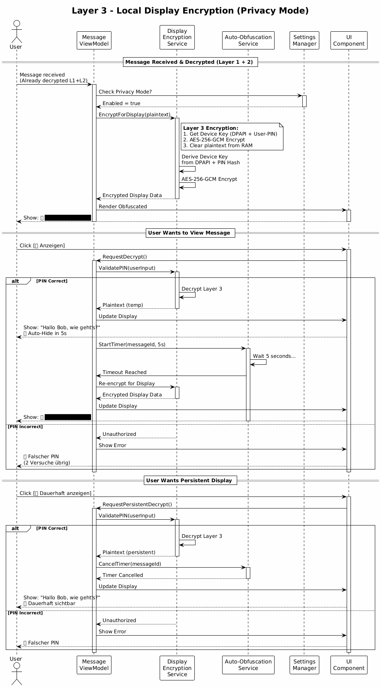

# Kryptographie-Konzept

## 1. Übersicht

Die Secure Messenger Application verwendet eine **dreistufige Verschlüsselungsarchitektur**.


> **Quelle**: [02_encryption_layers.puml](diagrams/02_encryption_layers.puml)

### Verschlüsselungs-Ebenen

| Ebene | Name | Zweck | Algorithmen |
|-------|------|-------|-------------|
| **Layer 1** | E2E Transport | Server kann Nachrichten nicht lesen | ChaCha20-Poly1305, X25519 |
| **Layer 2** | Local Storage | Schutz bei Gerätediebstahl | AES-256-GCM, Argon2id |
| **Layer 3** | Display Encryption (Optional) | Anti-Shoulder-Surfing | AES-256-GCM, PIN |

## 2. Layer 1: End-to-End Transport-Verschlüsselung

### 2.1 Konzept

Server speichert nur verschlüsselte Daten (Zero-Knowledge).

### 2.2 Algorithmen

#### ChaCha20-Poly1305
- **Typ**: Authenticated Encryption
- **Schlüssellänge**: 256 Bit
- **Nonce**: 96 Bit
- **Tag**: 128 Bit

**Vorteile**:
- Schneller als AES ohne Hardware-Beschleunigung
- Side-Channel-resistent
- Verwendet von: Chrome, TLS 1.3, WireGuard

#### X25519
- **Kurve**: Curve25519
- **Sicherheit**: ~128 Bit (≈ RSA-3072)
- **Schlüssellänge**: 32 Bytes

**Vorteile**:
- Schnell
- Kompakt
- Verwendet von: Signal, WhatsApp

### 2.3 Schlüsselrotation (Forward Secrecy)


> **Quelle**: [04_key_rotation_sequence.puml](diagrams/04_key_rotation_sequence.puml)

**Konzept**: Ephemere Schlüssel pro Nachricht

```
Nachricht 1: Key A → Encrypt → Send → DELETE Key A ✓
Nachricht 2: Key B → Encrypt → Send → DELETE Key B ✓
```

**Resultat**: Kompromittierung von Key B ermöglicht NICHT das Entschlüsseln von Nachricht 1

## 3. Layer 2: Local Storage-Verschlüsselung

### 3.1 Konzept

Alle lokalen Daten werden mit passwortbasiertem Master Key verschlüsselt.

**Zweck**:
1. **Gerätediebstahl-Schutz**: Ohne Passwort sind Daten unlesbar
2. **Compliance**: DSGVO "Encryption at Rest"

```
┌─────────────────────────────────────────────────────────┐
│ Client (AUSGELOGGT)                                     │
│ - Private Keys: verschlüsselt                           │
│ - Messages: verschlüsselt                               │
│ ⚠️  Ohne Passwort: Alles unlesbar                       │
└─────────────────────────────────────────────────────────┘

┌─────────────────────────────────────────────────────────┐
│ Client (EINGELOGGT)                                     │
│ 1. Password → Argon2id → Master Key                     │
│ 2. Master Key entschlüsselt Private Keys (RAM)          │
│ 3. Master Key entschlüsselt Messages (RAM)              │
│ ✅ Bei Logout: Master Key aus RAM gelöscht              │
└─────────────────────────────────────────────────────────┘
```

### 3.2 Master Key Derivation

#### Argon2id
- **Typ**: Memory-hard Key Derivation
- **Parameter**:
  - Memory: 65536 KB (64 MB)
  - Iterations: 3
  - Parallelism: 4
  - Output: 32 Bytes

**Warum Argon2id?**
- Langsam gegen Brute-Force
- GPU-resistent
- Empfohlen von OWASP

```pseudocode
FUNCTION DeriveMasterKey(password, userSalt)
    config = {
        password: password,
        salt: userSalt,        // 32 Bytes, unique pro User
        iterations: 3,
        memory: 65536,
        parallelism: 4,
        outputLength: 32
    }
    
    masterKey = ARGON2ID(config)
    RETURN masterKey
END FUNCTION
```

### 3.3 Verschlüsselung lokaler Daten

#### AES-256-GCM
- **Typ**: Authenticated Encryption
- **Schlüssellänge**: 256 Bit (Master Key)
- **Nonce**: 96 Bit
- **Tag**: 128 Bit

**Vorteile**:
- Hardware-beschleunigt (AES-NI)
- Tampering Detection (Auth Tag)
- Schnell (~0.5ms pro Message)

```pseudocode
FUNCTION EncryptLocalData(plaintext, masterKey)
    nonce = RANDOM_BYTES(12)
    cipher = AES_GCM_256(masterKey)
    
    ciphertext, tag = cipher.ENCRYPT(nonce, plaintext)
    
    // Clear plaintext from memory
    SECURE_ZERO_MEMORY(plaintext)
    
    // Return: [nonce || ciphertext || tag]
    RETURN BASE64_ENCODE(nonce + ciphertext + tag)
END FUNCTION

FUNCTION DecryptLocalData(encryptedData, masterKey)
    data = BASE64_DECODE(encryptedData)
    
    nonce = data[0..11]
    tag = data[LENGTH-16..LENGTH]
    ciphertext = data[12..LENGTH-16]
    
    cipher = AES_GCM_256(masterKey)
    plaintext = cipher.DECRYPT(nonce, ciphertext, tag)
    
    RETURN plaintext
END FUNCTION
```

### 3.4 Private Key Storage

Private Keys werden verschlüsselt mit Master Key gespeichert:

```pseudocode
FUNCTION StorePrivateKey(privateKey, masterKey)
    encrypted = EncryptLocalData(privateKey, masterKey)
    
    SAVE_TO_DB("private_keys", encrypted)
    
    SECURE_ZERO_MEMORY(privateKey)
END FUNCTION

FUNCTION LoadPrivateKey(masterKey)
    encrypted = LOAD_FROM_DB("private_keys")
    privateKey = DecryptLocalData(encrypted, masterKey)
    
    RETURN privateKey
END FUNCTION
```

### 3.5 Session Management

```pseudocode
CLASS LocalStorageService
    PRIVATE masterKey = NULL
    
    FUNCTION Unlock(password)
        salt = LOAD_USER_SALT()
        masterKey = DeriveMasterKey(password, salt)
        
        // Test decryption
        TRY
            testData = LOAD_TEST_VALUE()
            DecryptLocalData(testData, masterKey)
            RETURN TRUE
        CATCH
            RETURN FALSE
        END TRY
    END FUNCTION
    
    FUNCTION Lock()
        IF masterKey IS NOT NULL THEN
            SECURE_ZERO_MEMORY(masterKey)
            masterKey = NULL
        END IF
    END FUNCTION
END CLASS
```

## 4. Layer 3: Display-Verschlüsselung (Optional)

### 4.1 Konzept

Layer 3 ist eine **optionale Client-seitige Verschlüsselung** für Anti-Shoulder-Surfing.

**Prinzip**: Nachrichten werden verschleiert angezeigt (🔒 ████████) und nur mit PIN sichtbar.


> **Quelle**: [17_layer3_display_encryption.puml](diagrams/17_layer3_display_encryption.puml)

### 4.2 Algorithmen

#### AES-256-GCM
- Gleich wie Layer 2

#### Windows DPAPI
- **Typ**: Data Protection API
- **Scope**: CurrentUser
- **Zweck**: Bindet Key an Windows-Benutzer

#### PIN-basierte Auth
- **Hash**: Argon2id
- **Parameter**: m=65536, t=3, p=1
- **Salt**: 32 Bytes

### 4.3 Device Key Derivation

```pseudocode
FUNCTION DeriveDeviceKey(userPin)
    // Machine-spezifischer Entropy
    machineKey = DPAPI_PROTECT(MACHINE_NAME)
    
    // Kombiniere mit PIN
    deviceKey = Argon2id(
        password: userPin,
        salt: machineKey,
        memory: 65536,
        iterations: 3,
        outputLength: 32
    )
    
    RETURN deviceKey
END FUNCTION
```

### 4.4 Encryption/Decryption

```pseudocode
FUNCTION EncryptForDisplay(plaintext, deviceKey)
    cipher = AES_GCM_256(deviceKey)
    nonce = RANDOM_BYTES(12)
    
    ciphertext, tag = cipher.ENCRYPT(nonce, plaintext)
    
    SECURE_ZERO_MEMORY(plaintext)
    
    RETURN BASE64_ENCODE(nonce + ciphertext + tag)
END FUNCTION

FUNCTION DecryptForDisplay(encryptedData, deviceKey, userPin)
    // PIN validieren
    IF NOT ValidatePIN(userPin) THEN
        THROW "Ungültige PIN"
    END IF
    
    data = BASE64_DECODE(encryptedData)
    
    nonce = data[0..11]
    tag = data[LENGTH-16..LENGTH]
    ciphertext = data[12..LENGTH-16]
    
    cipher = AES_GCM_256(deviceKey)
    plaintext = cipher.DECRYPT(nonce, ciphertext, tag)
    
    RETURN plaintext
END FUNCTION
```

### 4.5 Auto-Obfuscation

```pseudocode
CLASS AutoObfuscationService
    PRIVATE timers = {}
    
    FUNCTION ShowDecrypted(message, timeoutSeconds = 5)
        message.isDecrypted = TRUE
        
        timer = CREATE_TIMER(timeoutSeconds)
        timers[message.id] = timer
        
        timer.OnElapsed(() => {
            message.isDecrypted = FALSE
            SECURE_ZERO_MEMORY(message.plaintext)
        })
    END FUNCTION
    
    FUNCTION CancelAutoObfuscation(messageId)
        IF timers[messageId] EXISTS THEN
            timers[messageId].CANCEL()
        END IF
    END FUNCTION
END CLASS
```

### 4.6 Session-basierte PIN (v4.1)

**Problem**: PIN-Eingabe bei jeder Nachricht ist unpraktisch.

**Lösung**: PIN einmal pro Session:

```pseudocode
FUNCTION UnlockDisplayEncryption(pin)
    IF ValidatePIN(pin) THEN
        sessionToken = GENERATE_TOKEN()
        CACHE_IN_RAM(sessionToken, expires: 3600)  // 1 Stunde
        RETURN sessionToken
    END IF
END FUNCTION

FUNCTION DecryptForDisplay(encryptedData, sessionToken)
    IF NOT IS_VALID(sessionToken) THEN
        THROW "PIN-Eingabe erforderlich"
    END IF
    
    deviceKey = LOAD_KEY_FROM_SESSION(sessionToken)
    RETURN DECRYPT(encryptedData, deviceKey)
END FUNCTION
```

**Konfigurierbar**:
- Timeout: 5s - 3600s (User-wählbar)
- "Always Unlocked" Option (mit Sicherheitswarnung)

## 5. Gesamter Verschlüsselungsfluss

### 5.1 Alice sendet Nachricht an Bob

```
[Plaintext] 
→ Layer 1: E2E (Bob's PubKey) 
→ Server (verschlüsselt) 
→ Bob empfängt 
→ Layer 1: Decrypt 
→ Layer 2: Encrypt (Bob's Master Key) 
→ Layer 3: Encrypt (Display - optional)
→ Bob sieht: 🔒 ████████
→ Bob klickt "Anzeigen" + PIN 
→ Plaintext (5 Sekunden)
→ Auto-Obfuscation → 🔒 ████████
```

### 5.2 Performance

| Operation | Layer 1 | Layer 2 | Layer 3 | Gesamt | Ziel |
|-----------|---------|---------|---------|--------|------|
| **Encryption** | ~1-2 ms | ~0.5 ms | ~0.5 ms | ~2-3 ms | < 10 ms |
| **Decryption** | ~1-2 ms | ~0.5 ms | ~0.5 ms | ~2-3 ms | < 10 ms |
| **Master Key Derivation** | - | ~100-200 ms | - | - | Einmalig bei Login |
| **PIN Validation** | - | - | ~50-100 ms | - | < 200 ms |

**Optimierungen**:
- ✅ Master Key einmalig bei Login
- ✅ Hardware-Beschleunigung (AES-NI)
- ✅ Keys im RAM cachen (Session)

## 6. Sicherheitsanalyse

### 6.1 Bedrohungsmodell

| Angreifer | Layer 1 | Layer 2 | Layer 3 | Resultat |
|-----------|---------|---------|---------|----------|
| **Server-Kompromittierung** | ✅ Zero-Knowledge | ✅ Kein Master Key | - | ✅ Geschützt |
| **Gerätediebstahl** | ❌ | ✅ Verschlüsselt | - | ✅ Geschützt |
| **Shoulder Surfing** | - | - | ✅ Obfuscation | ✅ Geschützt |
| **Malware (Keylogger)** | ❌ | ❌ | ❌ | ❌ Nicht geschützt |

### 6.2 Warum drei Ebenen?

**Jede Ebene löst ein reales Problem**:
- **Layer 1**: Server-Kompromittierung
- **Layer 2**: Gerätediebstahl, DSGVO
- **Layer 3**: Shoulder Surfing in öffentlichen Räumen

### 6.3 Limitierungen

**Das System schützt NICHT vor**:
- ❌ Kompromittiertem Client (Malware, Rootkits, Keylogger)
- ❌ Memory-Dumps während Session (Master Key im RAM)
- ❌ Screen-Recording während Layer 3 Entschlüsselung
- ❌ Physischem Zugriff auf entsperrten PC

## 7. Best Practices

### 7.1 Key Storage

❌ **NIEMALS**: Private Keys in Plaintext speichern  
✅ **IMMER**: Private Keys mit Master Key verschlüsseln

❌ **NIEMALS**: `new Random()` für Kryptographie  
✅ **IMMER**: `RandomNumberGenerator`

### 7.2 Memory Management

✅ Sensitive Daten überschreiben nach Verwendung:
```pseudocode
SECURE_ZERO_MEMORY(sensitiveData)
```

✅ Master Key aus RAM löschen bei Logout  
✅ Ephemere Keys sofort löschen (Forward Secrecy)

### 7.3 Error Handling

❌ **NIEMALS**: Krypto-Fehler mit Details nach außen  
✅ **IMMER**: Generic "Decryption failed"

## 8. Compliance

### 8.1 Verwendete Standards

| Standard | Erfüllt | Details |
|----------|---------|---------|
| **BSI TR-02102-1** | ✅ | ChaCha20 (256 Bit), AES-256, SHA-384 |
| **NIST Standards** | ✅ | ChaCha20-Poly1305 (RFC 8439), AES-GCM (SP 800-38D) |
| **DSGVO Art. 32** | ✅ | Encryption at Rest (Layer 2), in Transit (Layer 1) |

---

**Dokument-Version**: 4.1  
**Letzte Aktualisierung**: 2025-01-06 (Layer 3 UX-Verbesserung)  
**Status**: Planungsphase
