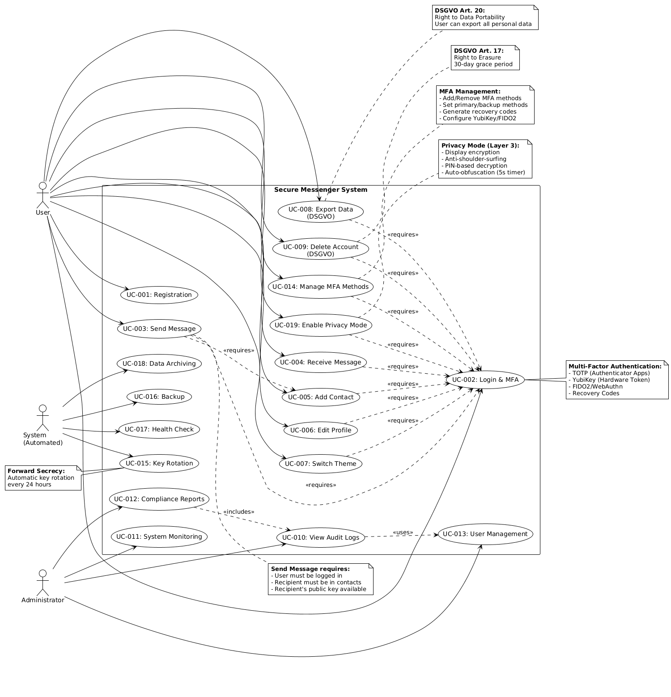
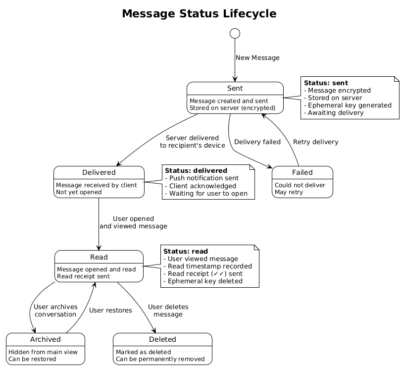
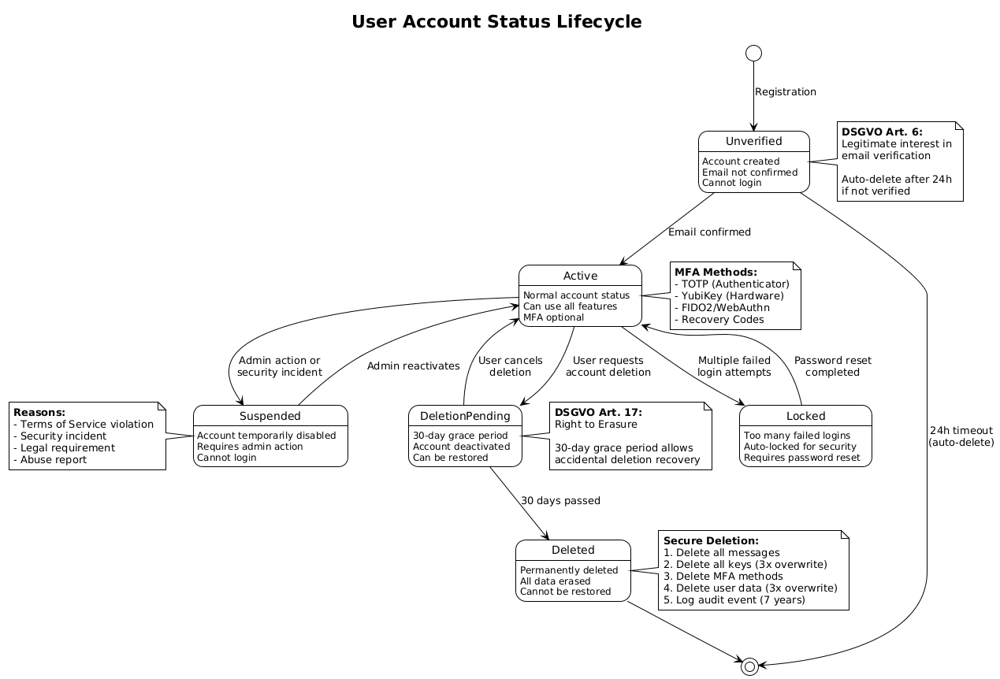
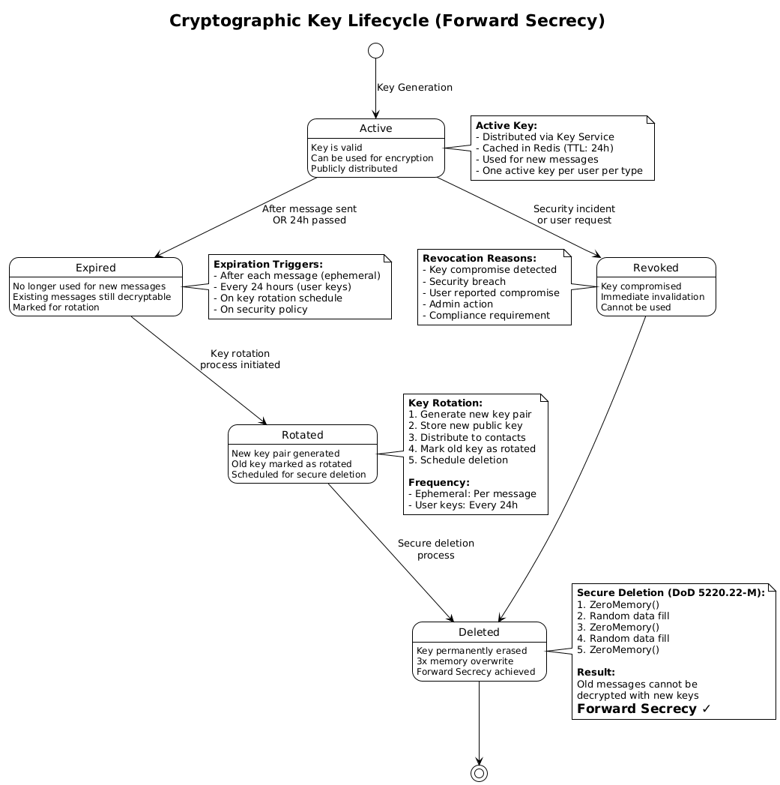
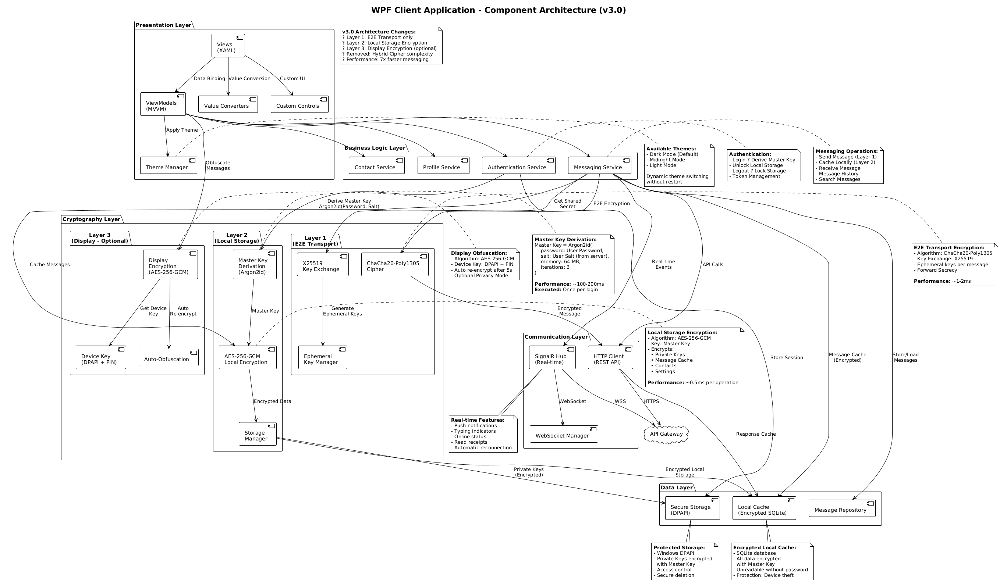

# Use Cases & Diagramme

## 1. Actor-Übersicht


> **Quelle**: [06_use_case_diagram.puml](diagrams/06_use_case_diagram.puml)

### Akteure

| Aktor | Rolle | Hauptaufgaben |
|-------|-------|---------------|
| 👤 **Benutzer** | Endnutzer | Messaging, Kontakte, Profil |
| 👨‍💼 **Administrator** | System Admin | Monitoring, Audit-Logs, Support |
| 🤖 **System** | Automatisiert | Key Rotation, Archivierung |

## 2. Use Case-Übersicht

### 2.1 Authentifizierung & Sicherheit

| ID | Use Case | Priorität | Komplexität |
|----|----------|-----------|-------------|
| UC-001 | Benutzerregistrierung | Hoch | Mittel |
| UC-002 | Login mit MFA | Hoch | Mittel |
| UC-007 | MFA aktivieren/deaktivieren | Mittel | Niedrig |
| UC-014 | MFA-Methoden verwalten | Mittel | Mittel |

### 2.2 Messaging

| ID | Use Case | Priorität | Komplexität |
|----|----------|-----------|-------------|
| UC-003 | Nachricht senden | Kritisch | Hoch |
| UC-004 | Nachricht empfangen | Kritisch | Hoch |

### 2.3 Kontakt-Management

| ID | Use Case | Priorität | Komplexität |
|----|----------|-----------|-------------|
| UC-005 | Kontakt hinzufügen | Hoch | Niedrig |
| - | Kontakt blockieren | Mittel | Niedrig |

### 2.4 Einstellungen

| ID | Use Case | Priorität | Komplexität |
|----|----------|-----------|-------------|
| UC-006 | Theme wechseln | Mittel | Niedrig |
| UC-019 | Privacy Mode aktivieren (Layer 3) | Niedrig | Mittel |

### 2.5 DSGVO

| ID | Use Case | Priorität | Komplexität |
|----|----------|-----------|-------------|
| UC-008 | Daten exportieren | Hoch | Mittel |
| UC-009 | Konto löschen (30-Tage-Frist) | Hoch | Hoch |

## 3. Detaillierte Use Cases

### UC-001: Benutzerregistrierung

**Actor**: Neuer Benutzer  
**Vorbedingung**: Keine  
**Hauptablauf**:
1. Benutzer gibt Daten ein (Username, E-Mail, Passwort)
2. System validiert Eingaben
3. System prüft Uniqueness (Username/E-Mail)
4. System hasht Passwort (Argon2id)
5. System generiert User Salt für Master Key (32 Bytes)
6. System erstellt Benutzer-Konto
7. System sendet Bestätigungs-E-Mail
8. Benutzer bestätigt E-Mail → Konto aktiviert

**Client-seitige Initialisierung**:
9. Client generiert E2E-Schlüsselpaar (X25519)
10. Client leitet Master Key ab: `Argon2id(Password, User Salt)`
11. Client verschlüsselt Private Key mit Master Key
12. Client speichert verschlüsselten Private Key lokal
13. Client sendet Public Key an Server

**Nachbedingung**: Aktiviertes Konto, Public Key auf Server, Private Key verschlüsselt lokal

---

### UC-002: Login mit Multi-Factor Authentication


> **Quellen**: 
> - [16_mfa_enable_sequence.puml](diagrams/16_2fa_enable_sequence.puml)
> - [18_mfa_login_sequence.puml](diagrams/18_mfa_login_sequence.puml)

**Actor**: Registrierter Benutzer  
**Vorbedingung**: Aktiviertes Konto  
**Hauptablauf**:
1. Benutzer gibt Username + Passwort ein
2. System validiert Credentials
3. **IF** MFA aktiviert: System fordert MFA-Code an
4. System zeigt verfügbare MFA-Methoden (TOTP, YubiKey, Recovery Code)
5. Benutzer wählt Methode und gibt Code ein
6. System validiert MFA-Code
7. System generiert JWT Access Token (15 Min) + Refresh Token (7 Tage)
8. **Client**: Master Key Derivation
   - **Ohne YubiKey**: `Argon2id(Password, Salt)`
   - **Mit YubiKey**: `HKDF(Argon2id(Password, Salt), YubiKey Response)`
9. **Client**: Entschlüsselt Private Key mit Master Key
10. **Client**: Master Key bleibt im RAM (nur während Session)

**Alternative Abläufe**:
- 2a. Credentials falsch → max 5 Versuche → Account Lock
- 6a. MFA-Code falsch → max 5 Versuche, dann 15 Min Sperre
- 6b. Recovery Code verwendet → neue MFA-Methode konfigurieren

**Nachbedingung**: Benutzer authentifiziert, lokaler Storage entsperrt

---

### UC-003: Nachricht senden


> **Quelle**: [03_send_message_sequence.puml](diagrams/03_send_message_sequence.puml)

**Actor**: Authentifizierter Benutzer (Alice)  
**Vorbedingung**: Alice eingeloggt, Bob als Kontakt  
**Hauptablauf**:
1. Alice öffnet Chat mit Bob
2. Alice tippt Nachricht
3. System lädt Bob's Public Key
4. **Layer 1**: E2E Encryption (ChaCha20-Poly1305)
   - Generiere Ephemeral Key Pair
   - Verschlüssle mit Bob's Public Key
5. System sendet verschlüsselt an Server
6. Server speichert verschlüsselt
7. **Layer 2**: Lokaler Cache
   - Verschlüssle Plaintext mit Alice's Master Key
   - Speichere in lokalem Cache (SQLite)
8. Bob empfängt Push Notification
9. Bob entschlüsselt, liest, sendet Read Receipt

**Alternative Abläufe**:
- 3a. Bob's Key nicht gefunden → Fehler
- 5a. Netzwerkfehler → Retry Queue
- 8a. Bob offline → Nachricht wartet

**Nachbedingung**: Nachricht zugestellt, auf Server E2E-verschlüsselt, lokal gecacht

---

### UC-004: Nachricht empfangen

**Actor**: Authentifizierter Benutzer (Bob)  
**Vorbedingung**: Bob eingeloggt, Alice hat Nachricht gesendet  
**Hauptablauf**:
1. System empfängt Push-Notification (SignalR)
2. System zeigt Notification
3. Bob öffnet Chat mit Alice
4. System lädt verschlüsselte Nachrichten
5. **Layer 1**: E2E Decryption
   - Entschlüssle mit Bob's Private Key
   - Lösche Ephemeral Key (Forward Secrecy)
6. **Layer 2**: Cache-Speicherung
   - Verschlüssle Plaintext mit Bob's Master Key
   - Speichere lokal
7. System zeigt Nachrichten
8. System sendet Read Receipt

**Nachbedingung**: Nachricht empfangen, lokal verschlüsselt gecacht

---

### UC-010: Logout

**Actor**: Authentifizierter Benutzer  
**Hauptablauf**:
1. Benutzer wählt "Logout"
2. System zeigt Bestätigung
3. **Client**: Lock Local Storage
   - Master Key aus RAM löschen
   - Private Keys aus RAM löschen
4. **Client**: JWT Token invalidieren
5. Server invalidiert Refresh Token
6. Logout-Event loggen
7. Weiterleitung zu Login

**Nachbedingung**: Benutzer ausgeloggt, alle lokalen Daten verschlüsselt

---

## 4. State Diagrams

### 4.1 Nachrichtenstatus


> **Quelle**: [08_message_status_state.puml](diagrams/08_message_status_state.puml)

```
Sent → Delivered → Read → {Archived | Deleted}
```

### 4.2 Konto-Status


> **Quelle**: [09_account_status_state.puml](diagrams/09_account_status_state.puml)

```
Unverified → Active ↔ {Suspended | Locked | Deletion Pending} → Deleted
```

### 4.3 Verschlüsselungs-Key Lifecycle


> **Quelle**: [10_key_lifecycle_state.puml](diagrams/10_key_lifecycle_state.puml)

```
Generated → Active → Expired → Rotated → Deleted
```

---

## 5. Component Diagram


> **Quelle**: [12_client_component_architecture.puml](diagrams/12_client_component_architecture.puml)

**Layers**:
- **Presentation**: Views (XAML), ViewModels, Theme Manager
- **Business Logic**: Messaging, Contact, Auth Services
- **Cryptography**: 
  - Layer 1: ChaCha20-Poly1305, X25519
  - Layer 2: AES-256-GCM, Argon2id, Master Key Manager
  - Layer 3: AES-256-GCM, DPAPI, PIN Auth
- **Communication**: HTTP Client, SignalR Hub
- **Data**: Local Cache (Encrypted), Secure Storage

---

**Dokument-Version**: 2.1  
**Letzte Aktualisierung**: 2025-01-06 (MFA Terminology Update)  
**Status**: Planungsphase
