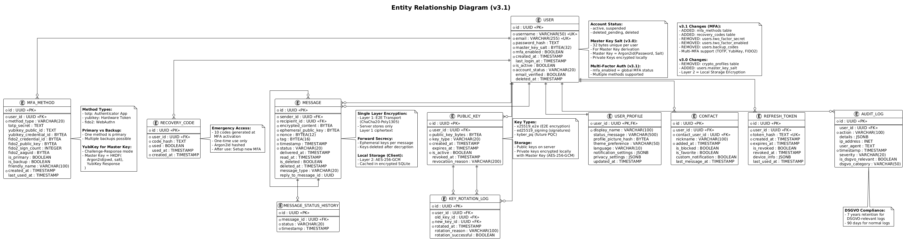

# Datenmodell & Datenbankschema

## 1. Übersicht

Das Secure Messenger System verwendet **PostgreSQL** als primäre Datenbank mit mehreren logisch getrennten Schemas für verschiedene Services.

### Datenbank-Struktur

```
PostgreSQL Server
├── messenger_auth      (Authentication Service)
├── messenger_messages  (Message Service)
├── messenger_keys      (Key Management Service)
├── messenger_users     (User Service)
└── messenger_audit     (Audit Log Service)
```

## 2. Entity Relationship Diagram


> **Diagramm-Quelle**: [07_entity_relationship.puml](diagrams/07_entity_relationship.puml)

### Entitäten-Übersicht

**Hauptentitäten**:
- `USER` - Zentrale Benutzer-Entität (mit Master Key Salt)
- `MESSAGE` - Verschlüsselte Nachrichten (E2E)
- `PUBLIC_KEY` - Public Key Storage & Rotation
- `CONTACT` - Kontaktlisten
- `REFRESH_TOKEN` - JWT Refresh Tokens
- `AUDIT_LOG` - DSGVO-konformes Logging

**Beziehungen**:
- USER 1:N MESSAGE (als Sender/Empfänger)
- USER 1:N PUBLIC_KEY
- USER 1:N CONTACT
- USER 1:N REFRESH_TOKEN
- USER 1:N AUDIT_LOG

**Wichtig**: 
- Private Keys werden **nicht auf dem Server** gespeichert
- Private Keys werden **lokal auf dem Client** verschlüsselt mit dem Master Key gespeichert
- Master Key wird aus `users.master_key_salt` + Benutzerpasswort abgeleitet (nur auf Client)

## 3. Detaillierte Tabellen-Definitionen

### 3.1 Authentication Database (messenger_auth)

#### users

```sql
CREATE TABLE users (
    id UUID PRIMARY KEY DEFAULT gen_random_uuid(),
    username VARCHAR(50) UNIQUE NOT NULL,
    email VARCHAR(255) UNIQUE NOT NULL,
    password_hash TEXT NOT NULL,
    
    -- Master Key Derivation Salt (für lokale Verschlüsselung)
    master_key_salt BYTEA NOT NULL,  -- 32 Bytes, unique pro User
    
    -- Multi-Factor Authentication Status
    mfa_enabled BOOLEAN DEFAULT FALSE,
    
    -- Account Management
    created_at TIMESTAMP DEFAULT NOW(),
    last_login_at TIMESTAMP,
    is_active BOOLEAN DEFAULT TRUE,
    account_status VARCHAR(20) DEFAULT 'active',  -- active, suspended, deleted_pending, deleted
    email_verified BOOLEAN DEFAULT FALSE,
    email_verification_token TEXT,
    password_reset_token TEXT,
    password_reset_expires_at TIMESTAMP,
    deleted_at TIMESTAMP,
    
    CONSTRAINT chk_username_length CHECK (char_length(username) >= 3),
    CONSTRAINT chk_email_format CHECK (email ~* '^[A-Za-z0-9._%+-]+@[A-Za-z0-9.-]+\.[A-Za-z]{2,}$')
);

CREATE INDEX idx_users_username ON users(username);
CREATE INDEX idx_users_email ON users(email);
CREATE INDEX idx_users_account_status ON users(account_status);
```

**Spalten-Beschreibungen**:

- `id`: Eindeutige Benutzer-ID (UUID), automatisch generiert.
- `username`: Benutzername, muss einzigartig und mindestens 3 Zeichen lang sein.
- `email`: E-Mail-Adresse, muss einzigartig sein und einem gültigen Format entsprechen.
- `password_hash`: Passwort-Hash, für die Authentifizierung verwendet.
- `master_key_salt`: Salz für die Ableitung des Master Keys, lokal auf dem Client verwendet.
- `mfa_enabled`: Globaler MFA-Status (wenn TRUE: mindestens eine MFA-Methode aktiv).
- `created_at`: Timestamp der Kontoerstellung, стандартно на jetzt gesetzt.
- `last_login_at`: Timestamp des letzten Logins.
- `is_active`: Status, ob der Benutzer aktiv ist, стандартно на TRUE.
- `account_status`: Status des Kontos (aktiv, gesperrt, zur Löschung vorgemerkt, gelöscht).
- `email_verified`: Обозначает, была ли подтверждена электронная почта пользователя.
- `email_verification_token`: Токен для подтверждения электронной почты.
- `password_reset_token`: Токен для сброса пароля.
- `password_reset_expires_at`: Время истечения действия токена сброса пароля.
- `deleted_at`: Время удаления пользователя (для мягкого удаления).

#### mfa_methods

**Zweck**: Speichert alle aktivierten Multi-Faktor-Authentifizierungs-Methoden pro Benutzer

```sql
CREATE TABLE mfa_methods (
    id UUID PRIMARY KEY DEFAULT gen_random_uuid(),
    user_id UUID NOT NULL REFERENCES users(id) ON DELETE CASCADE,
    method_type VARCHAR(20) NOT NULL,  -- 'totp', 'yubikey', 'fido2'
    
    -- TOTP-spezifisch (Authenticator App)
    totp_secret TEXT,  -- Base32-encoded Secret (160 Bit)
    
    -- YubiKey Challenge-Response
    yubikey_public_id TEXT,
    yubikey_credential_id BYTEA,
    
    -- FIDO2/WebAuthn
    fido2_credential_id BYTEA,
    fido2_public_key BYTEA,
    fido2_sign_count INTEGER DEFAULT 0,
    fido2_aaguid BYTEA,  -- Authenticator Attestation GUID
    
    -- Metadata
    is_primary BOOLEAN DEFAULT FALSE,
    is_backup BOOLEAN DEFAULT FALSE,
    friendly_name VARCHAR(100),  -- z.B. "Mein iPhone", "YubiKey Büro"
    created_at TIMESTAMP DEFAULT NOW(),
    last_used_at TIMESTAMP,
    
    CONSTRAINT chk_method_type CHECK (method_type IN ('totp', 'yubikey', 'fido2')),
    CONSTRAINT unique_primary_per_user UNIQUE (user_id, is_primary) DEFERRABLE INITIALLY DEFERRED
);

CREATE INDEX idx_mfa_methods_user_id ON mfa_methods(user_id);
CREATE INDEX idx_mfa_methods_type ON mfa_methods(method_type);
```

**Spalten-Beschreibungen**:
- `method_type`: Art der MFA-Methode
  - `totp`: Time-based One-Time Password (Google Authenticator, Authy, etc.)
  - `yubikey`: YubiKey Challenge-Response für Master Key Derivation
  - `fido2`: FIDO2/WebAuthn (phishing-resistent)
- `is_primary`: Primäre Methode (wird beim Login bevorzugt angezeigt)
- `is_backup`: Backup-Methode (als Fallback wenn primäre Methode nicht verfügbar)
- `friendly_name`: Benutzerfreundlicher Name zur Identifikation

**Business Rules**:
- Ein User kann mehrere MFA-Methoden haben
- Maximal eine Methode kann `is_primary = TRUE` sein
- Wenn `mfa_enabled = TRUE`, muss mindestens eine aktive Methode existieren

#### recovery_codes

**Zweck**: Notfall-Zugriffscodes wenn alle MFA-Methoden verloren gehen

```sql
CREATE TABLE recovery_codes (
    id UUID PRIMARY KEY DEFAULT gen_random_uuid(),
    user_id UUID NOT NULL REFERENCES users(id) ON DELETE CASCADE,
    code_hash TEXT NOT NULL,  -- Argon2id Hash des Recovery Codes
    used BOOLEAN DEFAULT FALSE,
    used_at TIMESTAMP,
    created_at TIMESTAMP DEFAULT NOW(),
    
    CONSTRAINT chk_not_reused CHECK (NOT (used = TRUE AND used_at IS NULL))
);

CREATE INDEX idx_recovery_codes_user_id ON recovery_codes(user_id);
CREATE INDEX idx_recovery_codes_used ON recovery_codes(user_id, used) WHERE used = FALSE;
```

**Spalten-Beschreibungen**:
- `code_hash`: Argon2id-Hash des 16-stelligen Recovery Codes (z.B. "ABCD-1234-EFGH-5678")
- `used`: Einmalverwendung - nach Verwendung wird Code ungültig
- `used_at`: Timestamp der Verwendung (für Audit Trail)

**Security Notes**:
- Recovery Codes werden wie Passwörter gehashed (Argon2id)
- Standard: 10 Codes pro User generiert bei MFA-Aktivierung
- Nach Verwendung eines Codes: User muss neue MFA-Methode konfigurieren
- Codes sollten sicher (offline) vom User gespeichert werden
