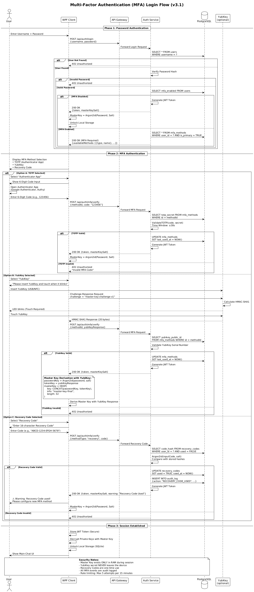

# Multi-Factor Authentication (MFA)

## 1. Übersicht

Das Secure Messenger System unterstützt **mehrere MFA-Methoden**, um unterschiedlichen Sicherheitsanforderungen und Nutzerpräferenzen gerecht zu werden.

### MFA-Strategie

**Defense in Depth**: Multiple Authentication Factors erhöhen die Sicherheit erheblich

```
┌────────────────────────────────────────────────────────┐
│ Authentifizierung = Etwas das du WEISST (Passwort)   │
│                   + Etwas das du HAST (Token/Device)   │
└────────────────────────────────────────────────────────┘
```

### Unterstützte MFA-Methoden

| Methode | Typ | Sicherheit | Benutzerfreundlichkeit | Kosten |
|---------|-----|------------|------------------------|--------|
| **TOTP** | Software Token | Hoch | Sehr gut | Kostenlos |
| **YubiKey** | Hardware Token | Sehr hoch | Gut | ~50€ |
| **FIDO2** | Hardware Token | Sehr hoch | Sehr gut | ~30-80€ |
| **Recovery Codes** | Backup | Mittel | Gut (Notfall) | Kostenlos |

---

## 2. TOTP (Time-based One-Time Password)

### 2.1 Konzept

**Algorithmus**: RFC 6238 (TOTP) basierend auf RFC 4226 (HOTP)

```
TOTP(K, T) = HOTP(K, T)
  wobei:
    K = Shared Secret (160-256 Bit)
    T = floor(Unix Timestamp / 30)  // 30-Sekunden-Fenster
```


> **Diagramm-Quelle**: [18_mfa_login_sequence.puml](diagrams/18_mfa_login_sequence.puml)
> 
> **Zeigt**: Kompletten Login-Flow mit TOTP, YubiKey und Recovery Codes

### 2.2 Implementierung

```pseudocode
CLASS TotpService
    PRIVATE CONSTANT TIMESTEP = 30  // Sekunden
    PRIVATE CONSTANT DIGITS = 6
    PRIVATE CONSTANT ALGORITHM = "SHA1"
    
    FUNCTION GenerateSecret() RETURNS Base32String
        secret = RANDOM_BYTES(20)  // 160 Bit
        RETURN BASE32_ENCODE(secret)
    END FUNCTION
    
    FUNCTION GenerateQRCode(username, secret, issuer = "SecureMessenger") RETURNS QRCodeImage
        uri = "otpauth://totp/" + issuer + ":" + username + 
              "?secret=" + secret + 
              "&issuer=" + issuer +
              "&algorithm=" + ALGORITHM +
              "&digits=" + DIGITS +
              "&period=" + TIMESTEP
        
        RETURN GENERATE_QR_IMAGE(uri)
    END FUNCTION
    
    FUNCTION ValidateCode(secret, userCode, allowedDrift = 1) RETURNS Boolean
        currentTime = UNIX_TIMESTAMP()
        currentStep = FLOOR(currentTime / TIMESTEP)
        
        // Prüfe aktuelles Zeitfenster + drift (für Clock-Skew-Toleranz)
        FOR step IN RANGE(currentStep - allowedDrift, currentStep + allowedDrift) DO
            expectedCode = GENERATE_TOTP(secret, step)
            
            IF CONSTANT_TIME_EQUALS(expectedCode, userCode) THEN
                RETURN TRUE
            END IF
        END FOR
        
        RETURN FALSE
    END FUNCTION
    
    PRIVATE FUNCTION GENERATE_TOTP(secret, timeStep) RETURNS String
        counter = PACK_INT64_BIG_ENDIAN(timeStep)
        hmac = HMAC_SHA1(BASE32_DECODE(secret), counter)
        
        // Dynamic Truncation (RFC 4226)
        offset = hmac[19] AND 0x0F
        binary = (hmac[offset] AND 0x7F) << 24
               | (hmac[offset+1] AND 0xFF) << 16
               | (hmac[offset+2] AND 0xFF) << 8
               | (hmac[offset+3] AND 0xFF)
        
        otp = binary MOD (10 ^ DIGITS)
        RETURN ZERO_PAD(otp, DIGITS)
    END FUNCTION
END CLASS
```

### 2.3 Registrierungs-Flow

```
User → [Aktiviere TOTP] → Server
Server → [Generiere Secret] → QR Code → User
User → [Scanne QR mit Authenticator App] → App speichert Secret
User → [Gebe ersten TOTP-Code ein] → Server
Server → [Validiere Code] → IF valid THEN aktiviere TOTP ✅
```

### 2.4 Login-Flow mit TOTP

```
User → [Username + Password] → Server
Server → [Validiere Credentials] → IF valid AND mfa_enabled THEN
Server → [Fordere TOTP-Code an] → User
User → [6-stelliger Code aus App] → Server
Server → [Validiere TOTP] → IF valid THEN
    IF method_type = 'totp' THEN
        masterKey = Argon2id(password, salt)  // Standard
    END IF
    → Login erfolgreich ✅
```

---

## 3. YubiKey (Hardware Token)

### 3.1 Konzept

**YubiKey**: Physischer USB/NFC Security Key mit kryptographischem Secure Element

**Modi für dieses Projekt**:
1. **Challenge-Response (HMAC-SHA1)**: Für Master Key Derivation
2. **FIDO2/WebAuthn**: Für phishing-resistenten Login (optional)

### 3.2 Challenge-Response Mode

**Zweck**: Deterministischer Secret für Master Key Derivation

```pseudocode
FUNCTION DeriveMasterKeyWithYubiKey(password, userSalt, yubiKeySlot = 2)
    // 1. Password-based Component
    passwordKey = Argon2id(password, userSalt, iterations: 3, memory: 65536)
    
    // 2. YubiKey Challenge-Response
    challenge = UTF8_ENCODE("master-key-challenge-v1")
    
    yubiKey = DETECT_YUBIKEY()
    IF yubiKey IS NULL THEN
        THROW "YubiKey nicht gefunden"
    END IF
    
    yubiKeyResponse = yubiKey.CalculateHmacSha1(
        slot: yubiKeySlot,
        challenge: challenge,
        requireTouch: TRUE  // User muss YubiKey berühren
    )
    
    // 3. Kombiniere beide Komponenten
    combinedKey = CONCAT(passwordKey, yubiKeyResponse)
    
    masterKey = HKDF_EXPAND(
        key: combinedKey,
        info: "master-key-final",
        length: 32
    )
    
    // Cleanup
    SECURE_ZERO_MEMORY(passwordKey)
    SECURE_ZERO_MEMORY(yubiKeyResponse)
    SECURE_ZERO_MEMORY(combinedKey)
    
    RETURN masterKey
END FUNCTION
```

**Wichtig**: 
- YubiKey Secret **verlässt niemals** das Gerät
- Ohne YubiKey ist Master Key **nicht ableitbar**
- **Backup TOTP** dringend empfohlen!

### 3.3 YubiKey Konfiguration

```bash
# Einmalige Konfiguration (User führt aus)
$ ykman otp chalresp --touch --generate 2

# Output:
# Using YubiKey serial number: 12345678
# Slot 2 is now configured with Challenge-Response (HMAC-SHA1)
# Touch required: Yes
```

**Konfiguration im System**:
```sql
INSERT INTO mfa_methods (user_id, method_type, yubikey_public_id, friendly_name, is_primary)
VALUES (
    'user-uuid',
    'yubikey',
    '12345678',  -- YubiKey Serial Number
    'YubiKey Büro',
    TRUE
);
```

### 3.4 Login-Flow mit YubiKey

```
User → [Username + Password] → Server
Server → [Validiere Credentials] → IF valid AND mfa_enabled THEN
Server → [Fordere YubiKey an] → User
User → [Steckt YubiKey ein] → Client
Client → [Challenge an YubiKey] → YubiKey
YubiKey → [Berühren erforderlich] → User berührt YubiKey
YubiKey → [HMAC-SHA1 Response] → Client
Client → [Leitet Master Key ab] → Master Key
Client → [Entschlüsselt Private Keys] → Login erfolgreich ✅
```

**Sicherheitsgewinn**:
- ✅ Selbst bei kompromittiertem Passwort: Ohne YubiKey kein Zugriff
- ✅ Phishing-resistent: YubiKey prüft nicht die Domain (Challenge-Response)
- ✅ Offline-fähig: Keine Internetverbindung benötigt

---

## 4. FIDO2/WebAuthn (Optional)

### 4.1 Konzept

**FIDO2**: Fast Identity Online 2.0 - Offener Standard für passwordless/MFA

**Unterschied zu Challenge-Response**:
- **Challenge-Response**: Für Master Key Derivation (offline)
- **FIDO2**: Für Web-Login (phishing-resistent, online)

### 4.2 Registrierung

```pseudocode
FUNCTION RegisterFido2Credential(userId, username)
    // 1. Server generiert Challenge
    challenge = RANDOM_BYTES(32)
    
    options = {
        challenge: BASE64_ENCODE(challenge),
        rp: {
            id: "secure-messenger.com",
            name: "Secure Messenger"
        },
        user: {
            id: BASE64_ENCODE(userId),
            name: username,
            displayName: username
        },
        pubKeyCredParams: [
            { type: "public-key", alg: -7 },  // ES256
            { type: "public-key", alg: -257 }  // RS256
        ],
        authenticatorSelection: {
            authenticatorAttachment: "cross-platform",  // YubiKey, etc.
            requireResidentKey: FALSE,
            userVerification: "preferred"
        },
        timeout: 60000,
        attestation: "direct"
    }
    
    RETURN options
END FUNCTION

// Client-seitig (Browser/WPF WebView)
credential = await navigator.credentials.create({ publicKey: options })

// Server speichert
INSERT INTO mfa_methods (
    user_id, method_type, fido2_credential_id, fido2_public_key, fido2_aaguid
) VALUES (
    userId,
    'fido2',
    credential.rawId,
    credential.response.getPublicKey(),
    credential.response.getAAGUID()
)
```

### 4.3 Authentication

```pseudocode
FUNCTION AuthenticateWithFido2(userId)
    // 1. Server generiert Challenge
    challenge = RANDOM_BYTES(32)
    
    // 2. Lade gespeicherte Credentials
    credentials = LOAD_FIDO2_CREDENTIALS(userId)
    
    options = {
        challenge: BASE64_ENCODE(challenge),
        allowCredentials: credentials.MAP(c => ({
            type: "public-key",
            id: c.credentialId
        })),
        timeout: 60000,
        userVerification: "preferred"
    }
    
    RETURN options
END FUNCTION

// Client-seitig
assertion = await navigator.credentials.get({ publicKey: options })

// Server validiert Signature
isValid = VERIFY_SIGNATURE(
    publicKey: storedPublicKey,
    signature: assertion.response.signature,
    data: CONCAT(
        assertion.response.authenticatorData,
        SHA256(assertion.response.clientDataJSON)
    )
)

IF isValid THEN
    // Update Sign Counter (Replay Protection)
    UPDATE mfa_methods 
    SET fido2_sign_count = assertion.response.authenticatorData.signCount
    WHERE id = credentialId
    
    RETURN SUCCESS
END IF
```

**Sicherheitsfeatures**:
- ✅ **Phishing-resistent**: Credential ist an Domain gebunden
- ✅ **Replay Protection**: Sign Counter verhindert Wiederverwendung
- ✅ **User Verification**: Optional biometrische Authentifizierung

---

## 5. Recovery Codes

### 5.1 Konzept

**Zweck**: Notfall-Zugriff wenn alle MFA-Devices verloren gehen

**Format**: 10 Codes à 16 Zeichen (z.B. `ABCD-1234-EFGH-5678`)

### 5.2 Generierung

```pseudocode
FUNCTION GenerateRecoveryCodes(userId, count = 10) RETURNS Array<String>
    codes = []
    
    FOR i IN RANGE(1, count) DO
        // Generiere kryptographisch sicheren Code
        randomBytes = RANDOM_BYTES(12)  // 96 Bit
        code = BASE32_ENCODE(randomBytes)
        
        // Formatiere: ABCD-1234-EFGH-5678
        formatted = FORMAT_CODE(code)
        codes.APPEND(formatted)
        
        // Hash und speichern
        userSalt = LOAD_USER_SALT(userId)
        codeHash = Argon2id(
            password: code,
            salt: userSalt,
            iterations: 3,
            memory: 65536
        )
        
        INSERT INTO recovery_codes (user_id, code_hash)
        VALUES (userId, codeHash)
    END FOR
    
    RETURN codes
END FUNCTION
```

### 5.3 Validierung

```pseudocode
FUNCTION ValidateRecoveryCode(userId, userCode) RETURNS Boolean
    userSalt = LOAD_USER_SALT(userId)
    
    // Hash input code
    inputHash = Argon2id(userCode, userSalt, iterations: 3, memory: 65536)
    
    // Suche passenden ungenutzten Code
    storedCode = QUERY_SQL(
        "SELECT id, code_hash FROM recovery_codes 
         WHERE user_id = ? AND used = FALSE",
        [userId]
    )
    
    FOR EACH code IN storedCode DO
        IF CONSTANT_TIME_EQUALS(code.code_hash, inputHash) THEN
            // Markiere als verwendet
            UPDATE recovery_codes 
            SET used = TRUE, used_at = NOW()
            WHERE id = code.id
            
            // Log Security Event
            LOG_SECURITY_EVENT(userId, "RECOVERY_CODE_USED")
            
            // Fordere User auf, neue MFA-Methode zu konfigurieren
            SEND_NOTIFICATION(userId, "Bitte konfigurieren Sie eine neue MFA-Methode")
            
            RETURN TRUE
        END IF
    END FOR
    
    RETURN FALSE
END FUNCTION
```

### 5.4 Best Practices

**Generierung**:
- ✅ Bei MFA-Aktivierung automatisch generieren
- ✅ Codes nur EINMAL anzeigen
- ✅ User auffordern, Codes sicher zu speichern (offline!)

**Speicherung (User)**:
- Passwort-Manager
- Ausgedruckt in Safe
- Verschlüsselte Datei

**Nach Verwendung**:
- ⚠️ Code ist ungültig
- ⚠️ User muss neue MFA-Methode konfigurieren
- ⚠️ Security Alert an User senden

---

## 6. Multi-MFA Management

### 6.1 Mehrere Methoden pro User

**Empfohlene Konfiguration**:

```
User "alice@example.com"
├─ Primary:   TOTP (iPhone Authenticator)
├─ Backup 1:  TOTP (iPad Authenticator)
├─ Backup 2:  YubiKey (Büro)
└─ Emergency: 8 verbleibende Recovery Codes
```

### 6.2 Login-Flow mit Multi-MFA

```pseudocode
FUNCTION LoginWithMultiMFA(username, password, mfaCode, methodId?)
    // 1. Passwort-Authentifizierung
    user = LOAD_USER(username)
    IF NOT VERIFY_PASSWORD(password, user.password_hash) THEN
        RETURN ERROR("Ungültige Credentials")
    END IF
    
    // 2. Prüfe MFA-Status
    IF NOT user.mfa_enabled THEN
        masterKey = Argon2id(password, user.master_key_salt)
        RETURN SUCCESS(masterKey)
    END IF
    
    // 3. Lade verfügbare MFA-Methoden
    methods = LOAD_MFA_METHODS(user.id)
    
    IF mfaCode IS NULL THEN
        // Client muss MFA-Code nachreichen
        RETURN MFA_REQUIRED(methods)
    END IF
    
    // 4. Validiere MFA-Code
    IF methodId IS NOT NULL THEN
        // Spezifische Methode gewählt
        method = methods.FIND(m => m.id = methodId)
        isValid = VALIDATE_MFA(method, mfaCode)
    ELSE
        // Prüfe alle Methoden
        FOR EACH method IN methods DO
            isValid = VALIDATE_MFA(method, mfaCode)
            IF isValid THEN BREAK
        END FOR
    END IF
    
    IF NOT isValid THEN
        RETURN ERROR("Ungültiger MFA-Code")
    END IF
    
    // 5. Update Last Used
    UPDATE mfa_methods 
    SET last_used_at = NOW()
    WHERE id = method.id
    
    // 6. Master Key Derivation (abhängig von Methode)
    IF method.method_type = 'yubikey' THEN
        masterKey = DeriveMasterKeyWithYubiKey(password, user.master_key_salt)
    ELSE
        masterKey = Argon2id(password, user.master_key_salt)
    END IF
    
    RETURN SUCCESS(masterKey)
END FUNCTION
```

### 6.3 UI/UX Flow

```
┌─────────────────────────────────────────┐
│ Login                                   │
│ Username: alice                         │
│ Password: ********                      │
│ [Weiter]                                │
└─────────────────────────────────────────┘
              ↓
┌─────────────────────────────────────────┐
│ Zwei-Faktor-Authentifizierung           │
│                                         │
│ Wählen Sie eine Methode:                │
│ ○ 📱 Authenticator App (Empfohlen)      │
│ ○ 🔑 YubiKey Büro                       │
│ ○ 🆘 Recovery Code                      │
│                                         │
│ [Weiter]                                │
└─────────────────────────────────────────┘
              ↓
┌─────────────────────────────────────────┐
│ 6-stelliger Code eingeben               │
│ ┌───┬───┬───┬───┬───┬───┐              │
│ │ 1 │ 2 │ 3 │ 4 │ 5 │ 6 │              │
│ └───┴───┴───┴───┴───┴───┘              │
│                                         │
│ [Bestätigen] [Andere Methode]          │
└─────────────────────────────────────────┘
```

---

## 7. Security Considerations

### 7.1 Bedrohungsmodell

| Angriff | Ohne MFA | Mit TOTP | Mit YubiKey |
|---------|----------|----------|-------------|
| **Passwort-Leak** | ❌ Kompromittiert | ✅ Geschützt | ✅ Geschützt |
| **Phishing** | ❌ Anfällig | ⚠️ Anfällig | ✅ Resistent (FIDO2) |
| **Keylogger** | ❌ Anfällig | ⚠️ Teilweise | ✅ Geschützt |
| **SIM-Swap** | N/A | ✅ Kein SMS | ✅ Kein SMS |
| **Device-Verlust** | N/A | ⚠️ Backup nötig | ⚠️ Recovery Codes! |

### 7.2 Rate Limiting

```pseudocode
// Schutz vor Brute-Force auf MFA-Codes
FUNCTION ValidateMFAWithRateLimit(userId, code)
    key = "mfa_attempts:" + userId
    attempts = REDIS_GET(key) OR 0
    
    IF attempts >= 5 THEN
        THROW "Zu viele fehlgeschlagene Versuche. Account temporär gesperrt (15 Min)"
    END IF
    
    isValid = VALIDATE_MFA_CODE(userId, code)
    
    IF NOT isValid THEN
        REDIS_INCR(key)
        REDIS_EXPIRE(key, 900)  // 15 Minuten
        RETURN FALSE
    ELSE
        REDIS_DEL(key)
        RETURN TRUE
    END IF
END FUNCTION
```

### 7.3 Best Practices

**Server-seitig**:
- ✅ TOTP Secrets verschlüsselt speichern
- ✅ Rate Limiting auf MFA-Validierung
- ✅ Audit Logging aller MFA-Events
- ✅ Constant-Time-Comparison für Codes

**Client-seitig**:
- ✅ Master Key nur im RAM (niemals auf Disk)
- ✅ Secure Memory Cleanup nach Verwendung
- ✅ YubiKey Touch-Required aktivieren

**User Education**:
- ⚠️ Backup-Methode konfigurieren (TOTP + YubiKey)
- ⚠️ Recovery Codes sicher speichern (offline)
- ⚠️ Bei YubiKey-Verlust: Sofort Recovery Code verwenden

---

## 8. Compliance & Standards

### 8.1 NIST SP 800-63B

**Authenticator Assurance Levels (AAL)**:

| Level | Anforderung | Implementierung |
|-------|-------------|-----------------|
| **AAL1** | Single-Factor (Password) | ✅ Basis-System |
| **AAL2** | Two-Factor | ✅ Password + TOTP/YubiKey |
| **AAL3** | Hardware Token + Crypto | ✅ Password + FIDO2 YubiKey |

### 8.2 BSI TR-02102

**Anforderungen**:
- ✅ Mehrere unabhängige Authentifizierungswege
- ✅ Memory-hard Key Derivation (Argon2id)
- ✅ Phishing-resistente Methoden verfügbar (FIDO2)
- ✅ Audit Logging aller Authentifizierungsereignisse

### 8.3 DSGVO Art. 32

**"Stand der Technik"**:
- ✅ Multi-Faktor-Authentifizierung = Best Practice
- ✅ Hardware-Token für hochsensible Daten
- ✅ Sichere Speicherung kryptographischer Geheimnisse

---

**Dokument-Version**: 1.0  
**Letzte Aktualisierung**: 2025-01-06  
**Nächste Review**: Sprint 9 (MFA Implementation)

